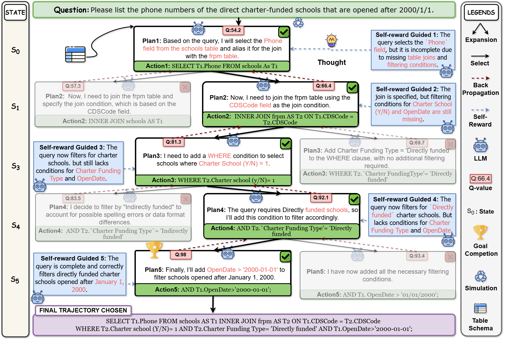

# SQL-o1: A Self-Reward Heuristic Dynamic Search Method for Text-to-SQL

## Overview

## Introduction

PyTorch implementation for **[SQL-o1: A Self-Reward Heuristic Dynamic Search Method for Text-to-SQL](http://arxiv.org/abs/2502.11741)**.

**Our code will come soon.**
